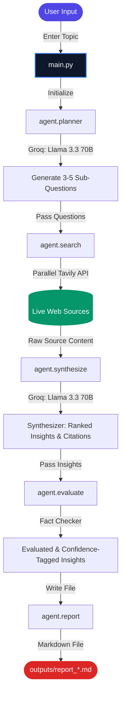

# Market Research & Trend Analysis Agent — Walkthrough

Here is a step-by-step demonstration of how the Market Research & Trend Analysis Agent works from input to final report.

## 1. System Architecture & Data Flow

The agent runs as a sequential pipeline, calling upon specialized modules to plan, execute, synthesize, fact-check, and output research.



---

## 2. Interactive Console Flow (Demo)

When you execute the agent, it guides you through its research execution in real time:

### Step 1: Input Topic
The agent prompts you to enter the topic, competitor, or niche:
```text
PS D:\AI Agents\market-research-agent> .\venv\Scripts\python.exe main.py
Enter a topic, competitor, or niche to research: ClickUp AI features
```

### Step 2: Planning Phase (Groq Llama 3.3 70B)
The orchestrator generates a set of targeted questions to cover the research topic:
```text
=== QUESTIONS ===
1. What are the current ClickUp AI features and how do they compare to other project management tools?
2. How are ClickUp users utilizing the AI features, and what benefits or pain points are they experiencing?
3. What are the most in-demand AI features among users, and how well does ClickUp meet them?
4. How do ClickUp's AI features impact user productivity and workflow efficiency?
5. What are the potential future applications and enhancements of ClickUp's AI features?
```

### Step 3: Concurrent Searching Phase (Tavily Search)
All searches run concurrently in parallel threads to maximize performance:
```text
Searching (1/5): What are the current ClickUp AI features and how do they com...
Searching (2/5): How are ClickUp users currently utilizing the AI features, a...
Searching (3/5): What are the most in-demand AI features among ClickUp users,...
Searching (4/5): How does ClickUp's AI feature set impact user retention and ...
Searching (5/5): What are the potential future applications and enhancements ...
```

### Step 4: Synthesis & Verification (Fact-Checking)
* **Raw Insights Generation:** The synthesizer ranks findings and embeds URLs.
* **Evaluation & Self-Correction:** The evaluator cross-checks citations, drops off-topic claims, and appends confidence tags (`[High]`, `[Medium]`, `[Low]`).

```text
=== EVALUATED INSIGHTS ===
1. ClickUp's AI features, particularly ClickUp Brain, provide a competitive advantage by offering contextual integration [Medium]
2. The ClickUp Brain AI assistant can auto-generate subtasks, summarize comment threads, and draft updates [Medium]
3. ClickUp's AI features, including Brain2, have been rapidly evolving, introducing rebuilt AI platforms and Super Agents [Medium]
...
```

### Step 5: Saved Markdown Report
The report is rendered into clean GitHub-Flavored Markdown:
```text
=== REPORT SAVED ===
outputs/report_clickup-ai-features_2026-08-09_21-55.md
```

---

## 3. Sample Report Format

Here is an abbreviated preview of the generated report in `outputs/`:

> # Market Research Report: ClickUp AI features
> *Generated: 2026-08-09 21:55*
>
> ## Insights
> 1. ClickUp's AI features, particularly ClickUp Brain, provide a competitive advantage... **[Medium]** *(Source: pmworld360.com)*
> 2. The ClickUp Brain AI assistant can auto-generate subtasks, summarize comments... **[Medium]** *(Source: ones.com)*
>
> ## Sources
> * [ClickUp Review 2026: Features & Pros](https://www.pmworld360.com/clickup-review-2025-is-it-worth-it-15-game-changing-features-that-make-teams-switch)
> * [AI Project Management Tools Compared](https://ones.com/blog/tool-guide/ai-project-management-tools-compared-58)
